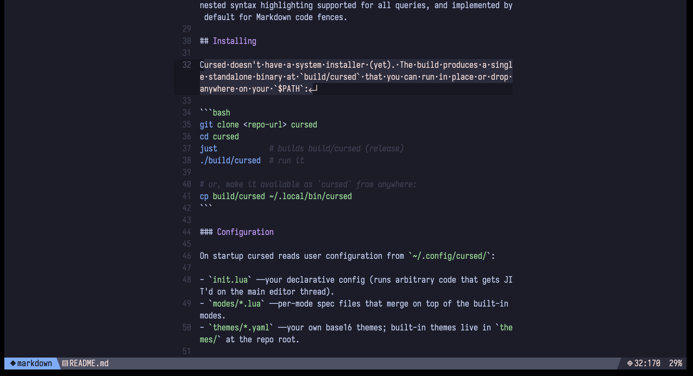
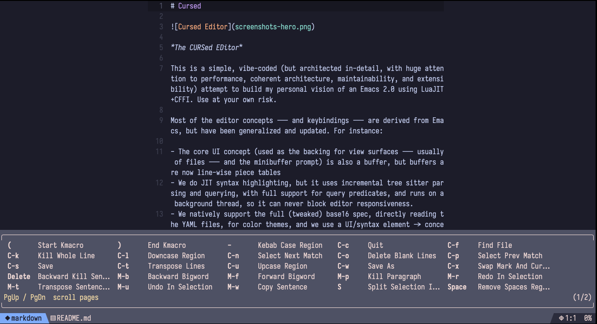
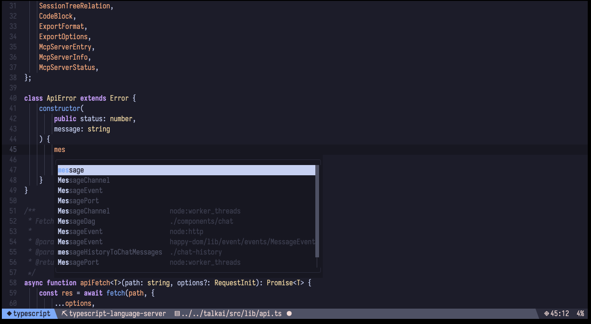
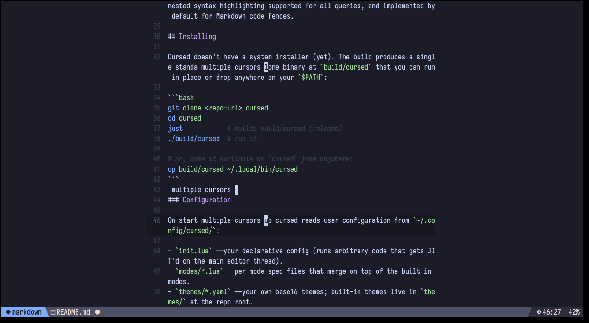
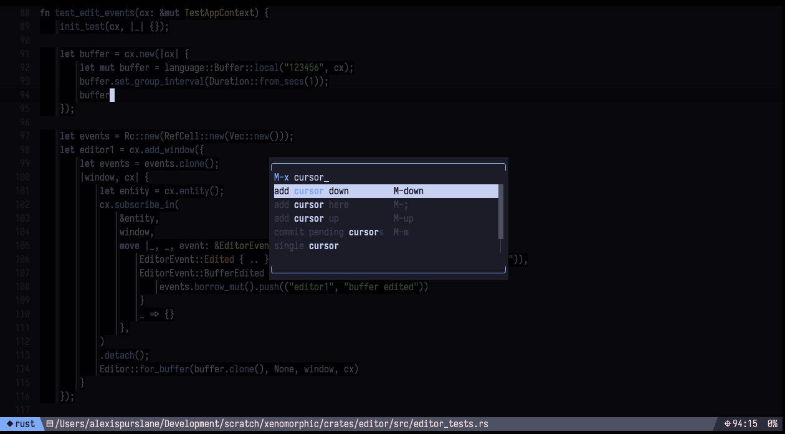
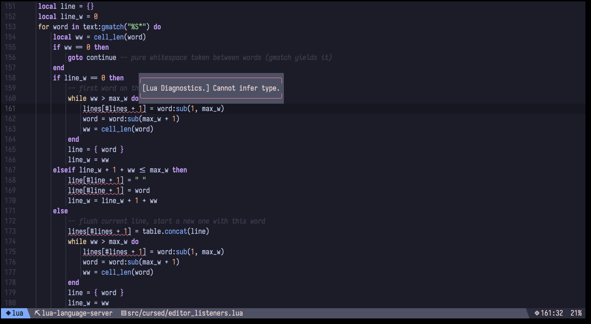
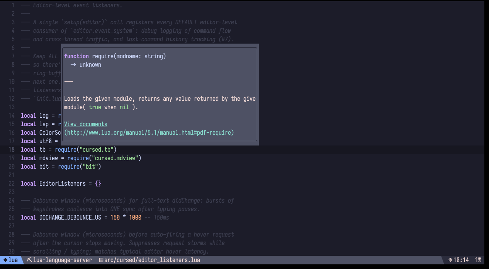

# Cursed



*The CURSed EDitor*

This is a simple, vibe-coded (but architected in-detail, with huge attention to performance, coherent architecture, maintainability, and extensibility) attempt to build my personal vision of an Emacs 2.0 using LuaJIT+CFFI. Use at your own risk.

Most of the editor concepts --- and keybindings --- are derived from Emacs, but have been generalized and updated. For instance:

- The core UI concept (used as the backing for view surfaces --- usually of files --- and the minibuffer prompt) is also a buffer, but buffers are now line-wise piece tables
- We do JIT syntax highlighting, but it uses incremental tree sitter parsing and querying, with full support for query predicates, and runs on a background thread, so it can never block editor responsiveness.
- We natively support the full (tweaked) base16 spec, directly reading the YAML files, for color themes, and we use a UI/syntax element -> concept -> base16 mapping designed to keep things as flexible as possible, and the whole UI auto-themes based around whatever theme you choose. Live theme previews with `load-theme` are supported.
- Modes are now unified: there is no distinction between a major mode and a minor mode, all modes can modify anything they want, including the current keymap of a view, and the last one applicable or started in a view wins. 
- Minibuffers have built in completion capabilities with a callback to determine the list of options and how they are filtered, and can be placed in the center of the screen or at the bottom, and get a scrollbar by default. Minibuffer answers can also be passed as arguments to the relevant commands, so there does not need to be a distinction between interactive and non-interactive functions/commands, or automatic minibuffer filling.
- Modes and `init.lua` are declarative by default, but can also run arbitrary code, which will be JIT'd and run in the main editor thread, with access to all of the same code, and capable of making all of the same modifications. There is a proper event bus --- not an ad-hoc hooks system --- and an advicing system fully as capable as Emacs Lisp's, and capable of modifying anything in the editor that runs on the main thread.
- The main editor is single-threaded to allow the extensibility covered in the previous point; however, a proper system of kqueues, message ring buffers, and separate lightweight LuaJIT interpreters running on other pthreads allows the editor to offload longer non-blocking CPU intensive tasks to other threads; meanwhile Lua coroutines allow asynchronous I/O, and a centralized background_tasks system integrated with the core event loop allows timed and non-timed background tasks to execute incrementally across many editor turns.
- Seamless, performant multiple cursors are enabled by the new buffer type, natively.
- The default modeline is specified with a declarative set of chunks with a format function and a background color, where foreground colors and powerline separators are automatically constructed and rendered for you. This, of course, can be completely replaced using advice.
- Universal arguments are no longer a single flag or a number, they are a full bash-style DSL syntax for specifying arbitrary arguments to the function you are calling. However, ergonomically, they are *identical* to Emacs universal arguments for the flag and number cases, and enter in an auto-submitting minibuffer for longer arguments. Universal arguments can also be specified after a colon in the `M-x` command minibuffer, and spaces can be used instead of dashes for commands in `M-x`, creating a natural-language-like syntax for running commands.
- The editor does not provide windows, because it assumes either your window manager or terminal --- e.g., Ghostty --- handles all of that, and does it better than a terminal editor could. However, multiple views/buffers are of course supported.
- All of the basic editing commands expected under Emacs are of course implemented, and support multiple cursors.
- Full unicode support, including combined characters and everything.
- Instead of Emacs Lisp, LuaJIT is used. LuaJIT, when using CFFI datatypes for packed data (which are automatically GC-managed, so no memory management issues!) is just as fast as C, and yet just as live-extensible on the fly based on loaded in, parsed, and JIT'd user code, as Emacs Lisp. This means we get the live runtime image capabilities of Emacs at no performance penalty, and with a more well-known and pleasant-to-use language. I'm sure NeoVim users will appreciate this.
- Undo and redo use piece table snapshots, instead of recording commands and inverting them, thus providing perfect restoration with a minimal amount of code, complexity, or unreliability.
- Undoing something pops that snapshot off the undo stack and puts it on the redo stack; modifying something pops more snapshots onto the undo stack. This gives the full power of an undo/redo system where *no information loss is possible*, without the confusing "undo the undo" system of classic Emacs. In addition, full "undo/redo within selection" --- even multiple cursor selections! --- is supported at best-effort.
- Full mouse and clipboard support out of the box.
- Due to Lua's greater speed, the *entire editor*, besides a minimal C wrapper that only exists to boot the compiled bytecode in a way that allows for a standalone executable, and manage the threads and ring buffers, can be implemented in Lua. This takes Emacs's idea of being implemented in a scripting language with a C core to the extreme: even the display code can be overridden.
- Tree-sitter grammars are provided with the editor, compiled statically into the binary with the default bytecode. This provides stability --- no more surprise version conflicts. We provide Rust, YAML, TOML, Bash, Markdown, Go, Python, Lua, C, and JSON highlighting out of the box, with nested syntax highlighting supported for all queries, and implemented by default for Markdown code fences.
- Plain text objects, syntax tables, and tree sitter syntax objects are all one concept, represented by functions that return a range plus how many characters to skip to next instance, so they can be used both for selection *and* movement from one single text object. These can be either custom functions for arbitrarily-complex mode-specific logic, or automatically generated by higher order functions using Lua patterns, balanced-pair delimiters, or arbitrary tree-sitter queries, whose captures' byte ranges become the textobject units.
- On top of that, `mark_<name>` / `forward_<name>` / `backward_<name>` / `forward_<name>_select` / `backward_<name>_select` commands are auto-generated for *every* textobject in the active view's merged set --- the defaults plus every active major mode's `textobjects` --- the instant a mode is entered or a parse tree lands, meaning all text object commands are immediately available from `M-x` or bindable to a key, without any per-object command boilerplate. The generation is idempotent and never clobbers hand-written or user-bound commands.
- Tree-sitter-based auto indentation and dedentation on all complete syntax tree nodes.
- Combined the above with a built in pattern-based electric-pair system that can complete *keywords* after complex expressions, not just standered brackets, so that no tree sitter syntax node ever needs to be incomplete
- Communication with the LSP (finding the binaries, spawning the processes, managing their lifecycle, encoding and decoding JSON messages) is handled on a separate thread which communicates asynchronously with the main thread in packed C structs, and JSON is handled by the extremely fast yyjson C library, allowing for LSP support to be extremely fast and totally nonblocking. **Every LSP request/response/notification is delivered through the editor event bus**, not ad-hoc callbacks or per-method handler registries: each main-minted request is paired with exactly one `lsp_response:<requestID>` event carrying `(result, is_error, client_id)` (a one-shot listener self-unregisters after firing, so nothing leaks on the success path), and inbound server notifications re-emit as `lsp_notification:<method>` (e.g. `textDocument/publishDiagnostics`). That means new consumers (or entirely new request/notification types) plug in by subscribing to the relevant event, with zero changes to the LSP client module. (Process lifecycle transitions — ready / dead / killed / missing — are likewise emitted as per-client `lsp_status:<client_id>` events; the modeline polls the registry directly via `lsp.server_status_for`, and the `lsp_start` / `lsp_restart` commands register a one-shot `lsp.on_status` listener that surfaces the spawn settle — "ready" / "not on PATH" / "failed to start" / "stopped" — as a status message when the handshake lands, instead of leaving the user watching a stuck "starting…".)
- A fully generalized, reusable **process management system** lives alongside the LSP integration in the same event-bus mould: any mode, command, or in-editor TUI can spawn arbitrary subprocesses via `editor.proc.spawn(argv, opts)` (returns a monotonic `procid`), feed their stdin, and kill them. The proc lane (its own pthread + lightweight LuaJIT interpreter running a `kqueue`/pipe loop) owns the fork/exec + child reaping, reads stdout/stderr, coalesces small reads into buffered chunks to avoid hammering the main loop, and relays each chunk + every terminal exit back to the main thread as packed C structs through a lock-free ring buffer. Main drains that inbox in the core event loop and converts each message to a `process_out:<procid>` event — `(stream="stdout"/"stderr", bytes)` for output, or `(kind="exited"/"signaled"/"failed"/"kill_sent", code)` for lifecycle — plus a `process_in:<procid>` channel for feeding stdin. So any subprocess's lifecycle and output — `ripgrep` for a future project-grep, a formatter, a REPL driven by a TUI mode, anything — is uniformly observable + extensible from user/mode code on the event bus, just like editor internals. (The LSP lane is a separate, sibling subsystem with its own subprocess + JSON-RPC framing code; it does not go through this generalized proc lane.)
- Generalized, unified in-buffer completion system that can accept the exact same "completer" higher-order-function interface as Minibuffers, uses the same interior rendering of options, is extremely fast and seamless, and supports dabbrev by default.
- Generalized oveerlay system that allows overlays both anchored to places in the file, and floating at specific places on the screen, and allows layered *modification* of the characters below it. This is used, for instance, to add LSP diagnostic underline (or squiggle, on modern terminals) to file text, without baking it in to the core renderer. We also, of course, support cancellable popups showing the text content of a diagnostic when the cursor is inside it, and the ability to jump to previous/next diagnostics.
- Structural selection (`expand-region` / `shrink-region`, bound to `Alt-'` / `Alt-"`): a single-chord, repeatable command that progressively selects larger semantic units around each cursor --- subword, word, bigword, sexp, line, defun, buffer --- and, when a tree-sitter parse tree is available for the document, seamlessly transitions into ascending the parse tree node-by-node so you can widen from a token all the way up to the root. `shrink-region` is the symmetric inverse, collapsing back toward the cursor's original position by descending the parse tree (or stepping down the textobject ladder). Both commands are multiple-cursor aware, track the seed point so shrink always returns to where expand started, and re-resolve tree nodes against a freshly acquired parse tree on every invocation so selections never reference freed memory.
- The core input, command, buffer, and view systems are so flexible that text-based user interfaces (see `examples/picker.lua` for a small example) are trivial to write *inside the editor*, similar to Emacs. 
   - Modes can simply:
     - write whatever UI they want to their view's backing buffer,
     - hijack the insertion of printable characters and the text editing commands with ones that edit the buffer to respond to state
     - use the cursor's current line and other editor state as forms of input
     - store backing state information on their mode instance
     - and introspect by reading their own buffer content
   - The key benefits of this are that these TUIs can:
     - reinstate full buffer text editing capabilities in limited locations within the buffer for text boxes and input fields that take full advantage of being inside an editor
     - use the editor's multithreaded process management system
     - be converted back to regular text for full editing by the user
     - share output data between arbitrary full TUI programs by simply converting the UI of a TUI program back to text and then making it the input, or even starting UI, of another TUI program by then enabling a different TUI mode

## Screenshots

### Built-In Which-Key



### LSP-Driven In-Buffer Completions



### Live Editing



### Minibuffer Completion



### Multiple Cursors


### LSP Diagnostics



### Hover Documentation



## Installing

Cursed doesn't have a system installer (yet). The build produces a single standalone binary at `build/cursed` that you can run in place or drop anywhere on your `$PATH`:

```bash
git clone <repo-url> cursed
cd cursed
just            # builds build/cursed (release)
./build/cursed  # run it

# or, make it available as `cursed` from anywhere:
cp build/cursed ~/.local/bin/cursed
```

### Configuration

On startup cursed reads user configuration from `~/.config/cursed/`:

- `init.lua` — your declarative config (runs arbitrary code that gets JIT'd on the main editor thread).
- `modes/*.lua` — per-mode spec files that merge on top of the built-in modes.
- `themes/*.yaml` — your own base16 themes; built-in themes live in `themes/` at the repo root.

The default theme and keybindings are usable out of the box, so an empty `~/.config/cursed/` is fine to start. See `themes/` for theme file format.

## Building

The build is fully self-contained: vendored LuaJIT, tree-sitter, termbox2, TRE, and language parsers are compiled and statically linked into one binary. **You do not need a system LuaJIT, tree-sitter, or any language runtime installed.**

### Prerequisites

Only a handful of standard build tools are required:

- **`just`** — the command runner that orchestrates the build ([install](https://github.com/casey/just)).
- **A C compiler** — `clang` (default) or `gcc`.
- **`make`** — used by the vendored LuaJIT and TRE builds.
- **`autotools`** (`autoreconf`, `configure`) — only needed on a clean build for the vendored TRE regex library; it's invoked once to generate TRE's `./configure`.

Optional, for development:

- **[`stylua`](https://github.com/JohnnyMorganz/StyLua)** — code formatting (`just fmt` / `just fmt-check`).
- **[`lua-language-server`](https://github.com/LuaLS/lua-language-server)** — type/lint checks (`just lint`).

### Build

```bash
just            # release build → build/cursed (default target)
just build      # same, explicitly
just build debug # debug build with -g -O0 and DEBUG defined
```

The `build` target runs four steps, each cached so subsequent builds are incremental:

1. **`build-luajit`** — compiles the vendored LuaJIT into `vendor/luajit/src/libluajit.a` (and the `luajit` host binary, used to emit bytecode).
2. **`compile-bytecode`** — ahead-of-time compiles every `src/**/*.lua` into a bytecode C header in `build/`, and generates `includes.inc` / `modules.inc` so the Lua modules are embedded in the binary.
3. **`compile-vendor`** — compiles tree-sitter core, termbox2, TRE, and each bundled language parser (`bash`, `c`, `go`, `json`, `lua`, `markdown`, `python`, `rust`, `toml`, `yaml`) into `.o` files in `build/`.
4. **`compile-binary`** — links `src/main.c` with all the objects, the static LuaJIT lib, and `libtre.a` (force-loaded) into `build/cursed`.

### Run / Develop

```bash
just run                    # build (release) then run ./build/cursed
just run-debug              # build (debug) then run
just run path/to/file       # open a file (quote paths with spaces)
just run 'path/with spaces' # spaces are fine inside quotes
# Multiple files or paths containing single quotes: call the binary directly:
#   ./build/cursed one two 'three with spaces'
```

### Checks

```bash
just check    # stylua --check + lua-language-server lint
just fmt      # format src/ with stylua
just clean    # remove build/ and clean the TRE build dir
just clean-vendor # also rebuild vendored LuaJIT / tree-sitter-lib from scratch
```

Build artifacts land entirely in `build/`; nothing outside the repo is touched except `~/.config/cursed/` at runtime.


